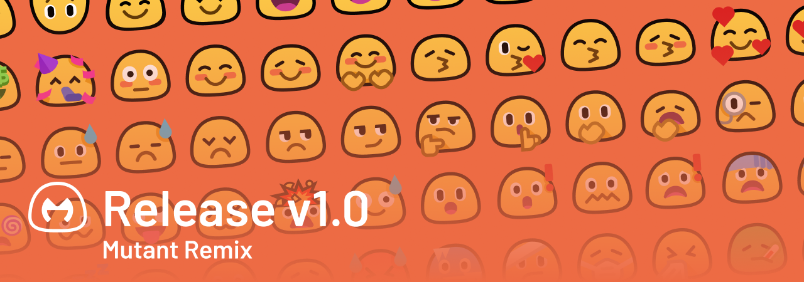

</img>

### 30th April 2021

# Welcome!

## What's Mutant Remix?

Mutant Remix brings a new twist to the good old emojis that have become a part of our daily conversations. It includes redesigned smileys, reminiscent of the old Android blobs, while adding a bunch of new emojis, so that you can truly express yourself the way you want to.

This project is designed for use with the Revolt platform, but feel free to contribute to our repository [here](https://gitlab.insrt.uk/revolt/mutant-remix/build) :)

*Disclaimer: This project is not affiliated with the original Mutant Standard project.*

## What's new?

- Our first release! 🥳
- 98 blob-ified smileys from Mutant Standard (+ some extras)
- New website! This will be the official home for Mutant Remix from now on :)

## Are there any differences in Mutant Remix?

Our first release only features redesigned smileys from the original Mutant Standard emoji pack, but in the future we plan to fill in all the gaps to have full compatibility with Unicode (flags, missing symbols, extras, etc.)

## License and usage

Mutant Remix and Mutant Standard share the same [Creative Commons Attribution-NonCommercial-ShareAlike 4.0 International](https://creativecommons.org/licenses/by-nc-sa/4.0/) license, so please check out the license terms before using either pack. We also have a handy usage guide that can be [found here](https://mutant.revolt.chat#usage).

-----

> Mutant Remix is not affiliated with [Mutant Standard](https://mutant.tech/). This is a transformation of the original Mutant Standard emoji pack, created by nizune for [Revolt](https://revolt.chat/).
